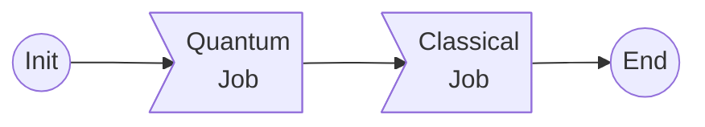

# myqlm-wf
This is an example folder containing myqlm jobs. The simplest workflow is following -

Where the quantum job is evolving a Hamiltonian in time, coded in [quantum-task.py](./quantum-task.py) script, which yields the final state vector $|\psi\rangle$,
and the classical job reads the statevector, and computes the vector $\langle\psi| {\bf s_i}|\psi \rangle$ and matrix $\langle\psi| {\bf s_i\cdot s_j}|\psi \rangle$ . The code to compute these is located in [struc_fac.py](./struc_fac.py).

The script [run.sh](./run.sh) can be submitted to execute the tasks.

> The Hamiltonian in the problem represents 2D ising model in square lattice.

Both the tasks are written as individual cell in the [qc-together.ipynb](./qc-together.ipynb) notebook for interactive usage.

### Dependency

The only dependency to execute the codes is [myqlm](https://myqlm.github.io/) package, preferably in a conda like environment, and setup for remote QPU of myqlm.

For any queries, contact - rajarshi.tiwari @ ichec.ie.