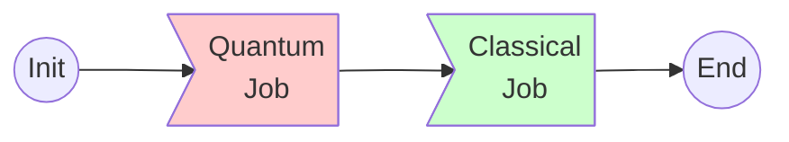
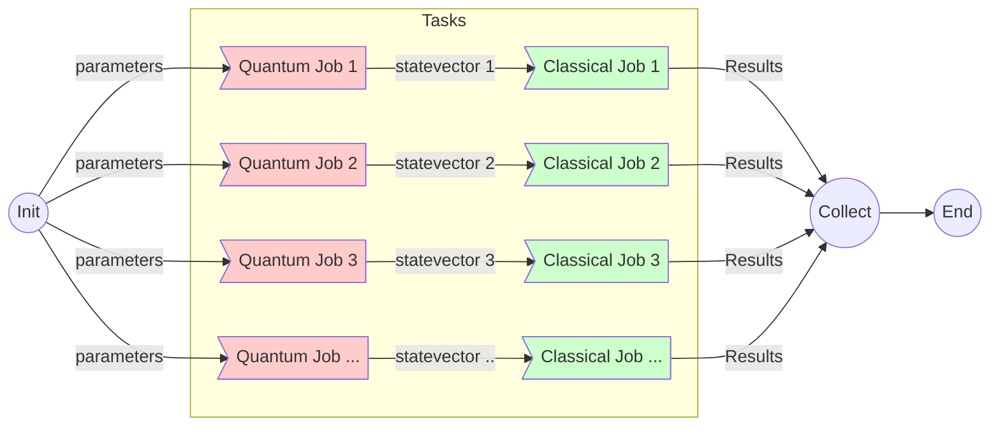

# myqlm Workflows

This repository contains various examples of hybrid quantum-classical workflows.

## Workflow 1

This is the simplest workflow. The example is in folder [workflow1](./workflow1/), and the workflow looks like following -

## Workflow 2

This example shows how to taskfarm quantum-classical jobs as above in `workflow1` via MPI. This example is in folder [workflow2](./workflow2/) and looks like following - 

### Dependency

The only dependency to execute the codes is [myqlm](https://myqlm.github.io/) package, preferably in a conda like environment, and setup for remote QPU of myqlm.

For any queries, contact - rajarshi.tiwari @ ichec.ie.

### Acknlowedgement

This activity is part of the HPCQS project, and work is done under the WP3-WP5 coordination where ICHEC and ParTec are partners.