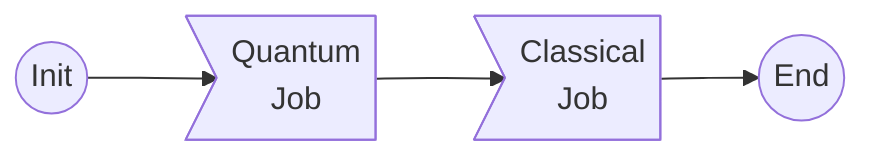

# myqlm-wf
In this example we have a very simple workflow, that looks like followin -



Where the quantum job is evolving a Hamiltonian in time, coded in [quantum-task.py](./quantum-task.py) script, which yields the final state vector $|\psi\rangle$,
and the classical job reads the statevector, and computes the vector $\langle\psi| {\bf s_i}|\psi \rangle$ and matrix $\langle\psi| {\bf s_i\cdot s_j}|\psi \rangle$ . The code to compute these is located in [struc_fac.py](./struc_fac.py).

The script [run.sh](./run.sh) can be submitted to execute the tasks.

> The Hamiltonian in the problem represents 2D ising model in square lattice.

Both the tasks are written as individual cell in the [qc-together.ipynb](./qc-together.ipynb) notebook for interactive usage.

### Dependency

The only dependency to execute the codes is [myqlm](https://myqlm.github.io/) package, preferably in a conda like environment, and setup for remote QPU of myqlm.

For any queries, contact - rajarshi.tiwari @ ichec.ie.

### MPI environment
Instead of writing the intermediate data into a file, we initialize MPI environment to send data via high-speed interconnect(via TCP or share memory on VM).

Precondition: install mpi4py library with the PATH of ParaStation MPI.
On VM, we can set PATH of installed ParaStation MPI in .bashrc

```bash
PSCOM="/opt/parastation"
export PATH="${PSCOM}/bin${PATH:+:}${PATH}"
export CPATH="${PSCOM}/include${CPATH:+:}${CPATH}"
export LD_LIBRARY_PATH="${PSCOM}/lib64${LD_LIBRARY_PATH:+:}${LD_LIBRARY_PATH}"
export LIBRARY_PATH="${PSCOM}/lib64${LIBRARY_PATH:+:}${LIBRARY_PATH}"

#PSMPI
PARASTATION_MPI="/opt/parastation/mpi"
export PATH="${PARASTATION_MPI}/bin${PATH:+:}${PATH}"
export CPATH="${PARASTATION_MPI}/include${CPATH:+:}${CPATH}"
export LD_LIBRARY_PATH="${PARASTATION_MPI}/lib64${LD_LIBRARY_PATH:+:}${LD_LIBRARY_PATH}"
export LIBRARY_PATH="${PARASTATION_MPI}/lib64${LIBRARY_PATH:+:}${LIBRARY_PATH}"
```

Please set python PATH for the installed mpi4py.

The hamiltonian evolvement in quantum task and the postprocessing in classical task remains the same. In the quantum task, after the results are obtained from the quantum job, MPI is initialzed as a master and a new process is spawned to do the postprocessing work. The results from quantum job are sent to the worker via MPI send. The worker will be initialized and start to postprocess data after it receives data from the master.

Instead of using a batch script, this test can be done via an interactive session: 

```bash
salloc -N2 --partition=cpu
```

After the resource is granted, we can run: 

```bash
srun -n 1 python ./quantum-task.py
```

We can also submit run.sh: sbatch `run.sh`
Please compile `classical-task.py` into an execuatable.

