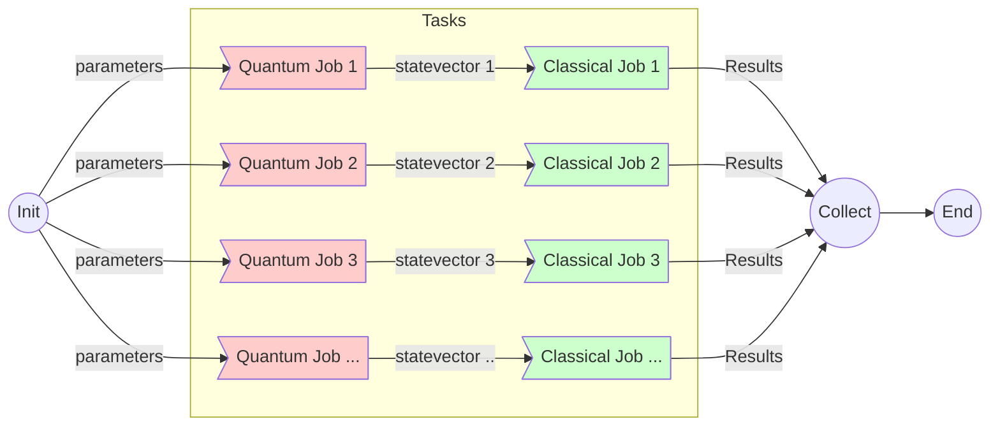

# myqlm-wf
In this example we have a taskfarming workflow, that looks like following -


This is the taskfarming version of the [workflow1](../workflow1/README.md), where we run a the quantum job which evolves a Hamiltonian in time, which yields the final state vector $|\psi\rangle$, and the classical job reads the statevector, and computes the vector $\langle\psi| {\bf s_i}|\psi \rangle$ and matrix $\langle\psi| {\bf s_i\cdot s_j}|\psi \rangle$.

A representative `input` for the quantum job looks like following dictionary:

```python
params = {
    'L1': L1,                # Number of qubits in the first dimension
    'L2': L2,                # Number of qubits in the second dimension
    'R0': 6.0,               # Lattice spacing
    'T_max': 0.6,            # The waveform of Omega - for the sigma_x terms
    'omega_max': 1.73144604, # from pulser_myqlm rad/µs
    'Omega': 1.2,            # Amplitude
    'delta': 2.0,            # detuning
    'C6': 1.5                # interaction scale
}
```

If one had to sweep any of the above parameters, say $R_0$, over a certain range, then these tasks can be run in parallel.
So the modified [quantum-task.py](./quantum-task.py) uses MPI to launch processes for individual quantum tasks, corresponding
to parameters $\{p_1, p_2, ...\}$, which yields resulting statevectors $\{|\Psi_1\rangle, |\Psi_2\rangle, |\Psi_3\rangle, ...\}$.

The statevectors are passed to corresponding processes designated for classical tasks via second script [classical-task.py](./classical-task.py)

The script [run.sh](./run.sh) can be submitted to execute the tasks.

```bash
#!/bin/bash -l
#SBATCH -p debug -N 4
#SBATCH --job-name hybrid-run-mpi

micromamba activate qc
srun -n 2 python ./quantum-task.py
```

> The Hamiltonian in the problem represents 2D ising model in square lattice.

The representative result of a run can be seen in [3x3](./3x3/) folder.

### Dependency

The only dependency to execute the codes is [myqlm](https://myqlm.github.io/) package, preferably in a conda like environment, and setup for remote QPU of myqlm.

For any queries, contact - rajarshi.tiwari @ ichec.ie.

### MPI environment
Instead of writing the intermediate data into a file, we initialize MPI environment to send data via high-speed interconnect(via TCP or share memory on VM).

Precondition: install mpi4py library with the PATH of ParaStation MPI.
On VM, we can set PATH of installed ParaStation MPI in .bashrc

```bash
PSCOM="/opt/parastation"
export PATH="${PSCOM}/bin${PATH:+:}${PATH}"
export CPATH="${PSCOM}/include${CPATH:+:}${CPATH}"
export LD_LIBRARY_PATH="${PSCOM}/lib64${LD_LIBRARY_PATH:+:}${LD_LIBRARY_PATH}"
export LIBRARY_PATH="${PSCOM}/lib64${LIBRARY_PATH:+:}${LIBRARY_PATH}"

#PSMPI
PARASTATION_MPI="/opt/parastation/mpi"
export PATH="${PARASTATION_MPI}/bin${PATH:+:}${PATH}"
export CPATH="${PARASTATION_MPI}/include${CPATH:+:}${CPATH}"
export LD_LIBRARY_PATH="${PARASTATION_MPI}/lib64${LD_LIBRARY_PATH:+:}${LD_LIBRARY_PATH}"
export LIBRARY_PATH="${PARASTATION_MPI}/lib64${LIBRARY_PATH:+:}${LIBRARY_PATH}"
```

Please set python PATH for the installed mpi4py.

The hamiltonian evolvement in quantum task and the postprocessing in classical task remains the same. In the quantum task, after the results are obtained from the quantum job, MPI is initialzed as a master and a new process is spawned to do the postprocessing work. The results from quantum job are sent to the worker via MPI send. The worker will be initialized and start to postprocess data after it receives data from the master.


